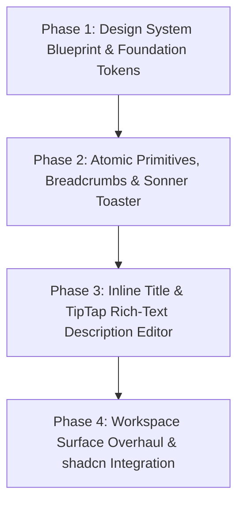

# Linear-Grade Design System & Architectural Blueprint

> **Product:** Project Management & AI Workspace  
> **Philosophy:** Dark-Mode-Native, Atomic, Precision-Engineered, Purple Accent, Borderless/Whisper-Border Luminance

---

## 1. Visual Theme & Atmosphere

Our workspace is an engineering-first, dark-mode-native product designed for extreme speed, clarity, and precision. Built on a near-black canvas (`#08090a`), the interface rejects harsh, high-contrast 1px boxed outlines around every component. Instead, structure and visual hierarchy emerge through **calibrated luminance stepping**, subtle background opacity gradations (`rgba(255,255,255,0.02)` to `0.05`), whisper-thin borders (`rgba(255,255,255,0.05)` to `0.08`), and borderless rows with soft hover highlights.

### Key Characteristics:
- **Dark-Mode-Native Canvas:** `#000000` base, `#08090a` workspace canvas, `#0f1011` panel/sidebar background, `#141517` elevated surfaces.
- **Luminance Over Boxed Outlines:** Depth is communicated through background luminance stepping and micro-elevations rather than heavy solid borders.
- **Single Chromatic Brand Accent:** Linear's signature indigo-violet (`#5e6ad2` primary bg, `#7170ff` active/accent, `#828fff` hover) reserved strictly for primary actions, active navigation indicators, and key interactive states.
- **Dual-Engine Typography:** `Inter Variable` with OpenType features `"cv01", "ss03"` globally for clean geometric sans-serif text, paired with `Martian Mono` for code blocks and issue identifiers (`ENG-104`).
- **Atomic shadcn UI Component Foundation:** All interactive primitives derive from shadcn UI (`@/components/ui/`), backed by Radix primitives and styled with Tailwind CSS v4.

---

## 2. Color Palette & Semantic Tokens

### Background Surfaces & Luminance Stack
| Token | Hex / Value | Purpose |
|---|---|---|
| `--color-canvas-base` | `#000000` | Deepest root canvas |
| `--color-canvas-workspace` | `#08090a` | Main workspace background (boards, lists, pages) |
| `--color-panel-dark` | `#0f1011` | Sidebar, column containers, drawer background |
| `--color-surface-elevated` | `#141517` | Cards, popovers, dropdown menus, modals |
| `--color-surface-hover` | `rgba(255, 255, 255, 0.04)` | Interactive hover fill for table rows & list items |
| `--color-surface-active` | `rgba(255, 255, 255, 0.07)` | Selected / active item background |
| `--color-surface-inset` | `rgba(0, 0, 0, 0.40)` | Recessed input fields, code containers |

### Text & Content Hierarchy
| Token | Hex | Role |
|---|---|---|
| `--color-text-primary` | `#f7f8f8` | Primary text, titles, active navigation labels |
| `--color-text-secondary` | `#d0d6e0` | Secondary body text, descriptions, table cell data |
| `--color-text-tertiary` | `#8a8f98` | Muted labels, placeholders, keyboard shortcut hints |
| `--color-text-quaternary` | `#62666d` | Subdued metadata, relative timestamps, disabled states |

### Brand & Interactive Accent
| Token | Hex | Role |
|---|---|---|
| `--color-brand-primary` | `#5e6ad2` | Primary CTA background, active indicator pills |
| `--color-accent-violet` | `#7170ff` | Interactive links, focused borders, active badges |
| `--color-accent-hover` | `#828fff` | Hover state on brand interactive elements |

### Domain Tokens: Issue Priorities
| Priority | Color | Hex | Visual Indicator |
|---|---|---|---|
| **Urgent** | Rose / Red | `#f43f5e` | Solid urgent icon, high-contrast indicator |
| **High** | Orange | `#f97316` | 3-bar signal icon / pill |
| **Medium** | Amber / Yellow | `#eab308` | 2-bar signal icon / pill |
| **Low** | Blue | `#3b82f6` | 1-bar signal icon / pill |
| **None** | Muted Gray | `#737373` | Dotted signal icon / subdued chip |

### Domain Tokens: Workflow State Categories & Linear Status Icons
| Category / State | Icon Glyph | Color | Hex | Visual Spec |
|---|---|---|---|---|
| **Backlog** | Dotted Circle (`CircleDashed`) | Zinc Gray | `#8a8f98` | 14px circle with 8-dash stroke pattern |
| **Todo** (Unstarted) | Hollow Ring (`Circle`) | Slate / White | `#e2e8f0` | 14px circular outline with 1.5px stroke |
| **In Progress** (Started) | Amber Progress Pie | Amber / Yellow | `#f59e0b` | 14px circle with 25%-33% angular slice |
| **In Review** (Started) | Half-Filled Circle | Emerald / Green | `#22c55e` | 14px circle with 50% vertical half-fill |
| **Done** (Completed) | Solid Circle with Check | Linear Indigo | `#5e6ad2` | 14px solid filled circle with centered white checkmark |
| **Canceled** | Circle with X | Slate Muted | `#71717a` | 14px circle with centered 45° X cross |
| **Duplicate** | Circle with Slash | Slate Muted | `#71717a` | 14px circle with diagonal strike-through |

#### Linear StatusPicker Component Specification:
- **Popover Trigger:** Compact button or badge displaying the current `StatusIcon` + State name + chevron down.
- **Search & Filter:** "Change status..." header input with keyboard shortcut indicator (`S`).
- **Keyboard Shortcuts:** Direct number keys (`1` through `9`) to instantly select corresponding workflow states.
- **Selection State:** Active state denoted with a right-aligned checkmark (`✓`).
- **Theme Surface:** Floating elevated panel (`#141517`) with whisper border (`rgba(255, 255, 255, 0.08)`), subtle item hover (`rgba(255, 255, 255, 0.04)`), and 0-lag selection.

### Borders & Dividers (Whisper Borders)
| Token | Value | Role |
|---|---|---|
| `--color-border-subtle` | `rgba(255, 255, 255, 0.05)` | Default component boundaries (subtle hairline) |
| `--color-border-standard` | `rgba(255, 255, 255, 0.08)` | Popover, modal, card boundaries |
| `--color-border-divider` | `rgba(255, 255, 255, 0.04)` | Row separators, vertical column dividers |

---

## 3. Typography System

### Typefaces
- **Primary UI Sans:** `Inter Variable` with OpenType `font-feature-settings: "cv01", "ss03"` enabled globally.
  - `"cv01"` provides single-story alternate 'a'.
  - `"ss03"` provides geometric letterform adjustments.
  - **Signature Weight 510:** Linear's default UI weight between 400 (regular) and 500/600 (medium/semibold).
- **Monospace Companion:** `Martian Mono` (by Evil Martians, OFL-1.1) for issue identifiers (`ENG-104`), git branches, and code blocks.
  - Fallbacks: `ui-monospace, SF Mono, Menlo, monospace`.

### Workspace Typographic Scale
| Level | Font Family | Size | Weight | Line Height | Tracking | Usage |
|---|---|---|---|---|---|---|
| **Page Title** | Inter Variable | 20px (1.25rem) | 510 | 1.25 | -0.24px | Workspace page headers |
| **Drawer / Modal Title** | Inter Variable | 18px (1.13rem) | 590 | 1.30 | -0.18px | Issue detail titles, modal headers |
| **Section Header** | Inter Variable | 14px (0.88rem) | 590 | 1.40 | -0.15px | Sidebar section labels, drawer rails |
| **UI Body / Cell** | Inter Variable | 13px (0.81rem) | 510 | 1.50 | normal | Issue list rows, Kanban card titles |
| **Small / Meta** | Inter Variable | 12px (0.75rem) | 400 | 1.40 | normal | Timestamps, secondary metadata |
| **Caption / Tiny** | Inter Variable | 11px (0.69rem) | 510 | 1.30 | normal | Badges, subtask rollups, status pills |
| **Identifier** | Martian Mono | 12px (0.75rem) | 500 | 1.40 | normal | Issue keys (`ENG-104`), subtask tags |
| **Code Block** | Martian Mono | 13px (0.81rem) | 400 | 1.50 | normal | Markdown code blocks, JSON traces |

---

## 4. Atomic Primitives & Component Styling

### Buttons
- **Ghost Button (Default):** `background: transparent;` text: `#d0d6e0`; hover: `rgba(255,255,255,0.05)` fill; radius: `6px`. Used for toolbar actions, inline menu triggers, icon controls.
- **Subtle Button:** `background: rgba(255,255,255,0.03);` border: `1px solid rgba(255,255,255,0.06);` text: `#d0d6e0`; hover: `background: rgba(255,255,255,0.06);`. Used for secondary actions ("Add filter", "Display").
- **Primary Brand CTA:** `background: #5e6ad2;` text: `#ffffff`; radius: `6px`; hover: `#828fff`. Used for primary actions ("Create Issue", "Save").
- **Icon Button:** Circular (`radius: 50%`) or rounded 6px, hover: `background: rgba(255,255,255,0.05);`.

### Inputs & Inset Containers
- **Borderless Typographic Input:** Transparent background, no borders; seamless on focus; used for issue title inline editing.
- **Translucent Form Input:** `background: rgba(255,255,255,0.03);` border: `1px solid rgba(255,255,255,0.06);` radius: `6px`; focus: `border: 1px solid rgba(113,112,255,0.6); box-shadow: 0 0 0 1px rgba(113,112,255,0.2);`.

### Badges & Status Chips
- **StateBadge:** Rounded pill (`9999px` or `4px`), category-tinted icon + state name, 11px Inter weight 510.
- **PriorityBadge:** Signal icon with priority color, tooltip hint with shortcut (`1` Urgent, `2` High, `3` Medium, `4` Low, `0` None).
- **Identifier Tag:** `Martian Mono` 11px font, `#8a8f98` text, hover: `#f7f8f8`.

### Breadcrumbs
- Unified shadcn `Breadcrumb` primitive:
  - **TopNav Navigation:** `Workspace > [TeamKey] > Issues > [ENG-104]` with subtle chevrons (`ChevronRight 12px`) and interactive ancestor navigation.
  - **Issue Subtask Hierarchy:** `IssueBreadcrumbPath.tsx` rendering parent hierarchy pills with overflow truncation.

### Feedback & Notification Toaster
- **Sonner (`<Toaster />`):** Dark-mode toast notifications positioned at bottom-right.
  - Background: `#141517` with hairline border `rgba(255,255,255,0.08)`.
  - Used for issue mutations ("Issue ENG-104 created"), link copied to clipboard, upload progress, and undo actions.

---

## 5. Rich-Text Description Editor & Inline Title Editing (TipTap Integration)

### 5.1 Inline Title Editing (Linear Style)
- **Component:** `IssueTitleEditor` in `IssueDetailDrawer.tsx` and `[issueIdentifier]/page.tsx`.
- **Interaction:**
  - Displays as clean typography (`text-xl font-semibold text-white`).
  - Seamlessly editable on click or focus without clunky input box borders.
  - Auto-saves changes on `blur` or when pressing `Enter`.
  - Pressing `Escape` cancels edits and restores previous title.
  - Debounced PATCH call to `api.updateIssue(id, { title })`.

### 5.2 TipTap WYSIWYG Description Editor
- **Framework:** Headless TipTap (`@tiptap/react`, `@tiptap/pm`, `@tiptap/starter-kit`).
- **Typography & Styling:** Rendered in `Inter Variable` 14px with line height 1.6, secondary text color `#d0d6e0`.
- **Rich Formatting Supported:**
  - **Text Styling:** Bold (`Cmd+B`), Italic (`Cmd+I`), Strikethrough, Inline Code (`Cmd+E`).
  - **Structure:** Headings (`# `, `## `), Blockquotes (`> `), Bullet Lists (`- `), Ordered Lists (`1. `), Task Lists / Checkboxes (`[ ] `).
  - **Code Blocks:** Fenced code with `Martian Mono` styling.
  - **Markdown Shortcuts:** Realtime markdown input rules (typing `**text**` instantly becomes bold).
- **Floating Bubble Menu:**
  - Appears smoothly above text selections.
  - Compact dark pill (`#141517` bg, `1px solid rgba(255,255,255,0.08)` border, 6px radius) containing icons for Bold, Italic, Strikethrough, Code, Link.

### 5.3 Clipboard Image Paste & Async Upload Pipeline
- **Interaction:** User copies an image from clipboard / screenshot tool and presses `Cmd+V` / `Ctrl+V` in the editor.
- **Pipeline:**
  1. Editor intercepts `paste` event checking for image MIME types (`image/png`, `image/jpeg`, `image/webp`).
  2. Immediately inserts an inline image placeholder node displaying a subtle pulse / loading spinner.
  3. Client asynchronously calls `api.getUploadUrl(issueId, file.name, file.size, file.type)`.
  4. Client uploads the raw binary file to Supabase storage via the presigned URL.
  5. On upload completion, the placeholder node is seamlessly replaced with the permanent hosted image URL.
  6. Toast notification confirms: `"Image uploaded successfully"`.

### 5.4 Autosave & Synchronization
- **Debounced Autosave:** Changes are debounced by 800ms after typing stops; blurring immediately forces pending saves.
- **Dual Output:** TipTap automatically outputs and synchronizes:
  - `description_text`: Clean markdown / plain text string.
  - `description_json`: Structured ProseMirror AST JSON object.
- **Status Indicator:** Quiet indicator in the editor bottom rail ("Saved" with checkmark, or subtle "Saving...").

---

## 6. Exhaustive shadcn Component Architecture & Codebase Mapping

| # | shadcn Component | Target Surfaces & Files | Implementation Purpose |
|---|---|---|---|
| 1 | **Dialog** | `CreateIssueModal.tsx`, `CreateTeamModal.tsx`, `AIAssistantModal.tsx` | Accessible modal dialogs with focus trapping and backdrop blur. |
| 2 | **Sheet** | `IssueDetailDrawer.tsx` | Slide-over drawer from right edge with smooth animations. |
| 3 | **Command** | `CommandPalette.tsx` | Spotlight command palette (`Cmd+K`) powered by `cmdk` with fuzzy filtering. |
| 4 | **DropdownMenu** | `WorkspaceSidebar.tsx`, `TopNav.tsx`, Issue rows | Workspace switcher, user profile menu, issue action menus (`...`). |
| 5 | **Popover** | `KanbanBoard.tsx`, `IssueListView.tsx`, `IssueDetailDrawer.tsx` | Inline property pickers for State, Priority, Assignee, and Labels. |
| 6 | **Tooltip** | TopNav action icons, Sidebar triggers, Priority shortcuts | Micro-tooltips explaining shortcuts (`C` create, `K` search, `Esc` close). |
| 7 | **Badge** | `PriorityBadge.tsx`, `StateBadge.tsx`, Label tags | Semantic indicator pills for priority, workflow states, and team tags. |
| 8 | **Avatar** | `TopNav.tsx`, `WorkspaceSidebar.tsx`, Comments, Assignee | User avatars with initials fallback on dark background. |
| 9 | **Button** | Across all components | Standardized button variants (ghost, subtle, brand CTA, icon). |
| 10 | **Input** | Modals, Search inputs, Settings forms | Consistent dark-mode text input with focus ring. |
| 11 | **Textarea** | Modals, Comment composer | Auto-expanding textarea for comments and subtask descriptions. |
| 12 | **Select** | Settings forms, Invite modal | Dropdown select for roles, default teams, and notification settings. |
| 13 | **Tabs** | Issues page, Inbox, Settings, Issue drawer | Switching between Board/List, All/Assigned/Mentioned, Comments/Attachments. |
| 14 | **Calendar / DatePicker** | `IssueDetailDrawer.tsx`, `[issueIdentifier]/page.tsx` | Due date picker popover with dark calendar grid. |
| 15 | **ScrollArea** | `KanbanBoard.tsx`, `WorkspaceSidebar.tsx`, Drawer | Sleek custom scrollbars without browser layout shifts. |
| 16 | **Separator** | Across all components | Hairline `1px` subtle divider lines replacing harsh borders. |
| 17 | **Skeleton** | `KanbanBoard.tsx`, `IssueListView.tsx`, Drawer | Shimmering loading skeletons during initial hydration and route changes. |
| 18 | **Collapsible / Accordion** | `WorkspaceSidebar.tsx`, `KanbanBoard.tsx` swimlanes | Collapsing sidebar team lists and parent issue swimlane rows. |
| 19 | **Checkbox** | `IssueSubtasksTree.tsx`, bulk issue actions | Checkboxes for subtask completion and multi-issue selection. |
| 20 | **Switch** | Settings pages | Toggle switches for settings (notifications, compact view). |
| 21 | **Sonner / Toast** | Root layout (`layout.tsx`), all mutations | Modern, non-intrusive action confirmation toasts. |
| 22 | **ContextMenu & HoverCard** | `KanbanBoard.tsx`, `IssueListView.tsx` | Right-click issue actions & user profile preview cards on hover. |

---

## 7. Workspace Surface Layout Blueprints

### 7.1 Workspace Shell
- **Sidebar (`WorkspaceSidebar.tsx`):**
  - Background: `#0f1011` with hairline right border `rgba(255,255,255,0.05)`.
  - Workspace selector dropdown at top, followed by global links (Inbox, My Issues).
  - Teams section with collapsible team lists and quick-add action.
  - User profile trigger at bottom with status indicator.
- **TopNav (`TopNav.tsx`):**
  - Height: `52px`, background: `rgba(8, 9, 10, 0.85)` with blur filter `blur(12px)`.
  - Left: Interactive breadcrumbs with chevron separators.
  - Center/Right: View mode switcher (Board / List tabs), search trigger (`Cmd+K`), AI assistant trigger, and "+ New Issue" button.

### 7.2 Kanban Board (`KanbanBoard.tsx`)
- **Structure:**
  - Multi-column layout horizontally scrollable.
  - Columns: `#0f1011` background, hairline border, sticky header with state badge and count pill.
  - Cards: Elevated `#141517` background with whisper border `rgba(255,255,255,0.06)`, no harsh box outline.
  - Drag State: Dragged card renders with subtle shadow and border glow; drop target shows subtle accent line indicator.
- **Parent Swimlanes (`groupBy: 'parent'`):**
  - Collapsible horizontal row headers with parent issue identifier, title, progress bar, and chevron toggle.

### 7.3 Issue List View (`IssueListView.tsx`)
- **Structure:**
  - Dense, borderless data table optimized for high information density.
  - Rows: Clean transparent background; hover triggers soft fill `rgba(255,255,255,0.04)`.
  - Inline property selectors: Clicking Priority, State, or Assignee in the row opens a lightweight popover for instant edits without opening the drawer.

### 7.4 Issue Detail (Drawer & Full Page)
- **Drawer (`IssueDetailDrawer.tsx`) & Full Page (`[issueIdentifier]/page.tsx`):**
  - Left Column (Main):
    - Issue identifier in `Martian Mono` with ancestor subtask breadcrumb path.
    - Inline editable title (`IssueTitleEditor`).
    - TipTap rich-text description editor with image paste and autosave.
    - Subtasks tree with progress counter and inline "+ Add subtask" row.
    - Tabbed comments and attachments stream.
  - Right Column (Property Rail):
    - State, Priority, Assignee, Team, Labels, and Due Date property pickers with keyboard navigation.

### 7.5 Inbox / Triage (`inbox/page.tsx`)
- **Layout:**
  - Master-detail split view: Left list of notification items (assigned, mentioned, state changed), right preview panel.
  - Triage actions: Quick keyboard actions (`Accept`, `Decline`, `Snooze`).

---

## 8. Phased Implementation Roadmap

### Phase 1: Design System Blueprint & Foundation Tokens
- Configure typography: setup `Inter Variable` (`cv01`, `ss03`) and `Martian Mono`.
- Define dark-mode CSS tokens in `globals.css`: pure dark-mode luminance ramp (`#08090a`, `#0f1011`, `#141517`), domain priority colors, and state tokens.

### Phase 2: Atomic Primitives, Breadcrumbs & Sonner Toaster
- Add core shadcn primitives under `components/ui/`: `Button`, `Input`, `Badge`, `Avatar`, `Tooltip`, `Separator`, `Skeleton`.
- Install and mount `Sonner` (`<Toaster />`) in root layout for dark-mode action feedback.
- Migrate `TopNav.tsx` and `IssueBreadcrumbPath.tsx` to the unified shadcn `Breadcrumb` system.

### Phase 3: Inline Title & TipTap Rich-Text Description Editor
- Install TipTap packages (`@tiptap/react`, `@tiptap/pm`, `@tiptap/starter-kit`, `@tiptap/extension-placeholder`, `@tiptap/extension-bubble-menu`, `@tiptap/extension-image`).
- Build `IssueTitleEditor` (borderless typographic input, auto-save on blur/Enter, Escape to revert).
- Build `IssueDescriptionEditor` (TipTap WYSIWYG, bold/italics, floating bubble menu, clipboard image paste pipeline with `api.getUploadUrl`, debounced 800ms autosave).
- Integrate both editors into `IssueDetailDrawer.tsx` and `[issueIdentifier]/page.tsx`.

### Phase 4: Workspace Surface Overhaul & shadcn Integration
- Refactor `KanbanBoard.tsx` and `IssueListView.tsx` to remove harsh 1px boxed outlines and apply whisper borders with subtle luminance stepping.
- Adopt shadcn `Dialog` (modals), `Sheet` (drawer), `Command` (command palette), and `Popover`/`DropdownMenu` (inline property pickers).

---

## 9. Do's and Don'ts

### Do:
- Build on dark-mode-native luminance steps: deeper background for canvas (`#08090a`), lighter for elevated surfaces (`#141517`).
- Use whisper-thin borders (`rgba(255,255,255,0.05)` to `0.08`) and borderless row hover fills (`rgba(255,255,255,0.04)`).
- Use `Inter Variable` with `"cv01", "ss03"` for UI text, and signature weight 510 for default UI labels.
- Use `Martian Mono` for issue identifiers (`ENG-104`) and code blocks.
- Reserve brand indigo (`#5e6ad2` / `#7170ff`) strictly for primary actions, active navigation states, and interactive focal points.
- Provide immediate, subtle feedback through `Sonner` toasts and autosave status indicators.

### Don't:
- Don't wrap every component in harsh, high-contrast 1px boxed outlines.
- Don't use pure white (`#ffffff`) for body text — use `#f7f8f8` or `#d0d6e0` to prevent eye strain.
- Don't use heavy drop shadows on dark backgrounds — depth is created through background luminance stepping.
- Don't clutter Kanban cards with heavy editors; keep rich description editing inside the Detail Drawer and Full Page.
- Don't re-introduce marketing elements (hero banners, public changelogs, marketing footers) into workspace SaaS documentation.
