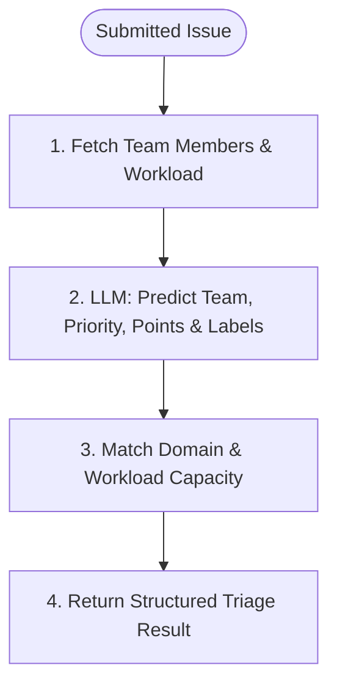
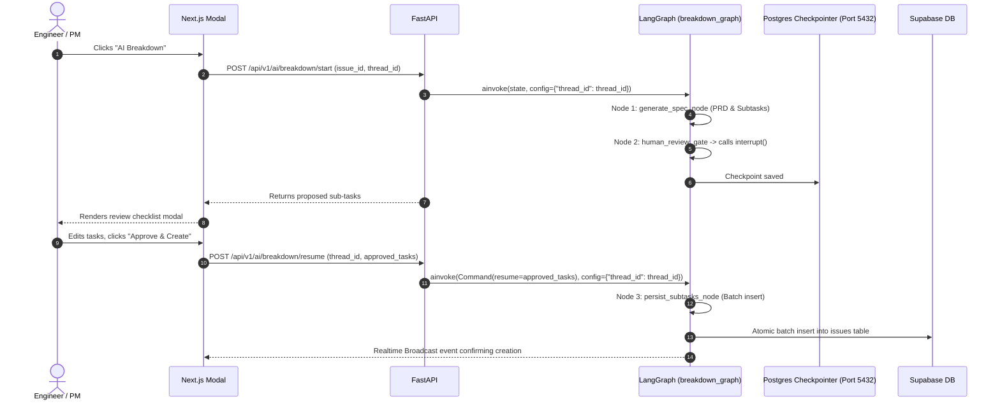

# Dedicated AI Agents Implementation Plan: Linear-Style System
**Frameworks:** LangChain & LangGraph (Python 3.12) • FastAPI • Supabase (`pgvector` + Realtime) • Next.js 15 (shadcn/ui)

---

## 1. AI Architectural Foundations & LangGraph Best Practices

The AI subsystem operates as an asynchronous, stateful multi-agent system built on **LangGraph**. It replaces rigid chains with cyclical StateGraphs, persistent PostgreSQL checkpointing (`AsyncPostgresSaver`), Human-in-the-Loop approval gates, token-bucket rate limiting, and real-time event streaming to the frontend via `@microsoft/fetch-event-source`.

```
 ┌────────────────────────────────────────────────────────────────────────┐
 │                   Next.js 15 Frontend (shadcn/ui)                      │
 │   fetchEventSource (POST) • Streaming Tokens • Human-in-the-Loop Modals│
 └───────────────────▲────────────────────────────────┬───────────────────┘
                     │ Server-Sent Events (SSE)       │ User Action / Approval
                     │ (astream_events v2)            │ (Command / Resume)
 ┌───────────────────┴────────────────────────────────▼───────────────────┐
 │                   FastAPI Asynchronous Gateway                         │
 │     /duplicates/check • /triage/classify • /breakdown/start & resume   │
 └───────────────────┬────────────────────────────────▲───────────────────┘
                     │ Invokes Graph                  │ Graph Checkpoint State
                     ▼                                │
 ┌────────────────────────────────────────────────────────────────────────┐
 │                      LangGraph Multi-Agent Runtime                     │
 │  ┌──────────────────────────────────────────────────────────────────┐  │
 │  │ 1. Triage & Duplicate Graph    2. Spec & Breakdown Graph        │  │
 │  │ 3. ReAct Workspace Assistant ("Linear Ask" with Tools & HITL)   │  │
 │  └──────────────────────────────────────────────────────────────────┘  │
 └───────┬──────────────────────────┬─────────────────────────────┬───────┘
         │ Async Tool Calling       │ Semantic Embeddings         │ Checkpoints (Port 5432)
         ▼                          ▼                             ▼
┌──────────────────┐      ┌──────────────────┐      ┌──────────────────┐
│ Supabase Async   │      │ Supabase pgvector│      │ Postgres Session │
│ Client Tools     │      │ (Iterative Scan) │      │ Checkpointer     │
└──────────────────┘      └──────────────────┘      └──────────────────┘
```

---

## 2. Checkpointer Lifespan Setup (Direct Session Connection)

> [!IMPORTANT]
> `AsyncPostgresSaver` requires a **direct session connection** (Port `5432` on Supabase via `DATABASE_DIRECT_URL`), NOT the transaction pooler (PgBouncer on Port `6543`), which breaks prepared statements and advisory locks.

```python
import os
from contextlib import asynccontextmanager
from fastapi import FastAPI
from psycopg_pool import AsyncConnectionPool
from langgraph.checkpoint.postgres.aio import AsyncPostgresSaver

checkpointer_pool: AsyncConnectionPool = None
checkpointer: AsyncPostgresSaver = None

@asynccontextmanager
async def lifespan(app: FastAPI):
    global checkpointer_pool, checkpointer
    # Connect directly to Postgres on port 5432
    checkpointer_pool = AsyncConnectionPool(
        conninfo=os.getenv("DATABASE_DIRECT_URL"),
        max_size=20,
        kwargs={"autocommit": True}
    )
    await checkpointer_pool.open()
    checkpointer = AsyncPostgresSaver(checkpointer_pool)
    await checkpointer.setup() # Idempotent migration creating checkpoints tables
    yield
    await checkpointer_pool.close()

app = FastAPI(lifespan=lifespan)
```

---

## 3. Decoupled Triage & Duplicate Pipeline

### A. Live Drafting Duplicate Check (`POST /api/v1/ai/duplicates/check`)
* **Trigger:** Debounced (600ms) while user types title (`length >= 15`).
* **Behavior:** Directly computes vector embedding and executes PostgreSQL RPC `match_similar_issues` (`< 200ms` backend execution). **Zero LLM tokens consumed**.
* **Payload:** `{ "title": str, "description": Optional[str], "issue_id": Optional[UUID] }`.

### B. Full LangGraph Triage Graph (`POST /api/v1/ai/triage/classify`)
* **Trigger:** Fired on issue submission or clicking "AI Auto-Triage".
* **Workload Loading Node:** Queries team active issues to recommend realistic assignees.



#### State & Output Schemas
```python
from typing import TypedDict, List, Optional
from pydantic import BaseModel, Field

class TriageOutput(BaseModel):
    suggested_team_key: str = Field(description="ENG, DES, PROD")
    suggested_priority: str = Field(description="urgent | high | medium | low")
    suggested_estimate: int = Field(description="Fibonacci points: 1, 2, 3, 5, 8")
    suggested_labels: List[str] = Field(description="Labels like bug, auth, performance")
    suggested_assignee_id: Optional[str] = Field(description="Recommended assignee user ID")
    reasoning: str = Field(description="Brief explanation of triage decisions")

class TriageState(TypedDict):
    issue_id: Optional[str]
    organization_id: str
    team_id: str
    title: str
    description: str
    team_workload: Optional[dict]
    triage_result: Optional[TriageOutput]
```

---

## 4. Spec Writer & Sub-Task Breakdown Agent (`breakdown_graph`)

### Node Isolation Across `interrupt()`
To prevent node re-execution on resume, the graph strictly isolates generation, interruption, and database insertion across separate nodes:



#### Graph Implementation
```python
from langgraph.graph import StateGraph, START, END
from langgraph.types import interrupt, Command

def generate_spec_node(state: BreakdownState) -> dict:
    # Pure LLM generation: returns proposed_spec without DB mutations
    spec = llm_with_structure.invoke(format_prompt(state))
    return {"proposed_spec": spec}

def human_review_gate(state: BreakdownState) -> dict:
    # Halts execution and yields spec to client
    approved_tasks = interrupt(value=state["proposed_spec"])
    return {"approved_tasks": approved_tasks}

async def persist_subtasks_node(state: BreakdownState, config: RunnableConfig) -> dict:
    # Executes only after resume; inserts sub-tasks in a single transaction
    user_jwt = config["configurable"]["user_jwt"]
    created_ids = await batch_create_subtasks(state["approved_tasks"], user_jwt)
    return {"created_issue_ids": created_ids}

# Build and compile graph
builder = StateGraph(BreakdownState)
builder.add_node("generate_spec", generate_spec_node)
builder.add_node("human_gate", human_review_gate)
builder.add_node("persist_subtasks", persist_subtasks_node)

builder.add_edge(START, "generate_spec")
builder.add_edge("generate_spec", "human_gate")
builder.add_edge("human_gate", "persist_subtasks")
builder.add_edge("persist_subtasks", END)

breakdown_app = builder.compile(checkpointer=checkpointer)
```

---

## 5. Linear Ask: ReAct Agent with Tool Authentication & HITL

Instead of an over-engineered multi-agent supervisor, **Linear Ask** runs a unified **LangGraph ReAct Agent** with authenticated tools and Human-in-the-Loop confirmations on state-mutating actions.

```python
from langgraph.prebuilt import create_react_agent
from langchain_core.tools import tool
from langchain_core.runnables import RunnableConfig

@tool
async def search_issues(query: str, config: RunnableConfig) -> list[dict]:
    """Search workspace issues using hybrid semantic vector and full-text search."""
    org_id = config["configurable"]["organization_id"]
    user_jwt = config["configurable"]["user_jwt"]
    
    query_vector = await embedding_service.aembed_query(query)
    
    async with get_async_supabase(user_jwt) as client:
        res = await client.rpc("match_similar_issues", {
            "query_embedding": query_vector,
            "match_threshold": 0.70,
            "match_count": 10,
            "p_organization_id": org_id
        }).execute()
        return res.data

@tool
async def update_issue_status(issue_identifier: str, state_name: str, config: RunnableConfig) -> str:
    """Update issue status (triggers Human-in-the-Loop confirmation)."""
    # Requires explicit confirmation before mutating
    confirmation = interrupt(f"Confirm changing {issue_identifier} status to '{state_name}'?")
    if not confirmation:
        return "Action canceled by user."
    ...
```

### Authenticated Streaming Endpoint (`POST /api/v1/ai/chat/stream`)
```python
@router.post("/chat/stream")
async def chat_stream(
    payload: ChatStreamRequest,
    current_user: AuthenticatedUser = Depends(get_current_user),
    user_jwt: str = Depends(get_raw_jwt)
):
    # Enforce secure thread_id namespace
    safe_thread_id = f"{current_user.organization_id}:{current_user.id}:{payload.thread_uuid}"
    
    config = {
        "configurable": {
            "thread_id": safe_thread_id,
            "organization_id": str(current_user.organization_id),
            "user_id": str(current_user.id),
            "user_jwt": user_jwt
        }
    }

    async def event_generator():
        async for event in linear_ask_agent.astream_events(
            {"messages": [("user", payload.message)]},
            config=config,
            version="v2"
        ):
            kind = event["event"]
            if kind == "on_chat_model_stream":
                content = event["data"]["chunk"].content
                if content:
                    yield f"data: {json.dumps({'type': 'token', 'content': content})}\n\n"
            elif kind == "on_tool_start":
                yield f"data: {json.dumps({'type': 'tool_start', 'tool': event['name']})}\n\n"
        yield "data: [DONE]\n\n"

    return StreamingResponse(event_generator(), media_type="text/event-stream")
```

---

## 6. Frontend Streaming Hook (`@microsoft/fetch-event-source`)

```typescript
// frontend/hooks/useAIChatStream.ts
import { fetchEventSource } from '@microsoft/fetch-event-source';
import { useSupabaseAuth } from '@/hooks/useSupabaseAuth';

export function useAIChatStream() {
  const { session } = useSupabaseAuth();

  const streamChat = async (message: string, threadUuid: string, abortCtrl: AbortController, onToken: (t: string) => void) => {
    await fetchEventSource('/api/v1/ai/chat/stream', {
      method: 'POST',
      headers: {
        'Content-Type': 'application/json',
        'Authorization': `Bearer ${session?.access_token}`,
      },
      body: JSON.stringify({ message, thread_uuid: threadUuid }),
      signal: abortCtrl.signal,
      onmessage(msg) {
        if (msg.data === '[DONE]') return;
        const data = JSON.parse(msg.data);
        if (data.type === 'token') onToken(data.content);
      },
    });
  };

  return { streamChat };
}
```
